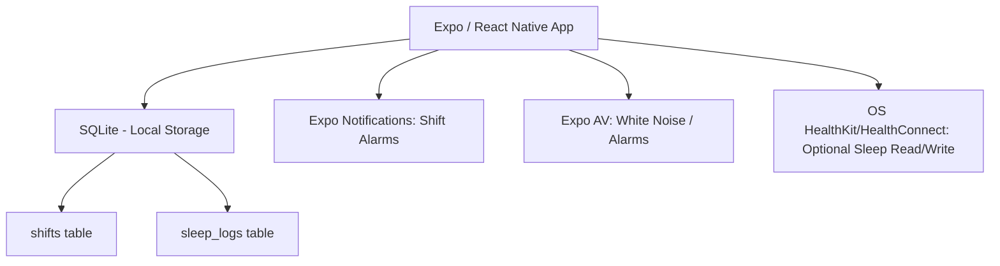

# Shift Worker Sleep Architecture

**Document:** ARCHITECTURE.md  
**Product:** Shift Worker Sleep  
**Publisher:** Heldig Lab  
**Price:** $4.99 Paid Upfront (One-Time Purchase). No Subscriptions.  
**Source of Truth:** [SPEC.md](./SPEC.md)  
**Related Documents:** [REQUIREMENTS.md](./REQUIREMENTS.md), [NON-FUNCTIONAL-REQUIREMENTS.md](./NON-FUNCTIONAL-REQUIREMENTS.md)

## Purpose

This document defines the architecture for "Shift Worker Sleep". It covers:

- Expo / React Native app structure
- Local SQLite data model for shift schedules
- Background task and Alarm management
- Audio playback (White noise)
- **The Zero-Backend Constraint**

## Architectural Principles & Competitive Edge

- **Strictly No Backend:** The app operates entirely offline. Shift schedules are highly sensitive personal data. There are no servers, no cloud sync, and no user accounts.
- **Deterministic Scheduling:** Sleep window recommendations are calculated via pure local functions based on SQLite shift entries. No external ML or API calls are used.
- **One Price Forever:** The business model is a simple $4.99 App Store / Play Store purchase. No RevenueCat, no trials, no ads.
- **System Integration:** Heavy reliance on native OS features (Local Notifications, Alarm APIs, Background Audio).

## System Context



## High-Level Component Model

### Client Layer

The client is an Expo-managed React Native app using:

- **React Navigation:** Stack & Tab navigation (Schedule, Sleep Planner, Wind Down, History).
- **Zustand:** Centralized state for active sleep mode and next alarm.
- **SQLite (expo-sqlite):** Persistent storage for all user shifts and sleep logs.
- **Expo Notifications:** Local push notifications to remind users to wind down before a calculated sleep window.
- **Expo AV:** Looping white/brown noise during the "Dark Room" sleep mode.

### The "No Backend" Reality

There is absolutely no backend infrastructure.
- No analytics tracking that leaks schedule patterns.
- No cloud storage.
- All sleep math (circadian offsets, nap calculations) is shipped as utility functions in the JS bundle.

## Data Model (SQLite)

### SQLite Schema

All dates/times are stored as ISO-8601 TEXT. The single database file is `shiftworker.db`, created on first launch via `expo-sqlite`.

```sql
-- User-entered work shifts
CREATE TABLE shifts (
    id                 INTEGER PRIMARY KEY AUTOINCREMENT,
    start_time         TEXT    NOT NULL,               -- ISO datetime of shift start
    end_time           TEXT    NOT NULL,               -- ISO datetime of shift end
    shift_type         TEXT    NOT NULL,               -- 'Day', 'Night', 'Split', 'On-Call'
    commute_minutes    INTEGER NOT NULL DEFAULT 0,     -- one-way commute in minutes
    is_recurring       INTEGER NOT NULL DEFAULT 0,     -- 1 = repeating pattern
    recurrence_pattern TEXT,                           -- e.g. 'weekly:mon,wed,fri'
    notes              TEXT,
    created_at         TEXT    NOT NULL DEFAULT (datetime('now'))
);

-- Algorithm-generated sleep recommendations for a shift
CREATE TABLE sleep_plans (
    id                      INTEGER PRIMARY KEY AUTOINCREMENT,
    shift_id                INTEGER NOT NULL REFERENCES shifts(id) ON DELETE CASCADE,
    recommended_sleep_start TEXT    NOT NULL,           -- ISO datetime
    recommended_sleep_end   TEXT    NOT NULL,           -- ISO datetime
    recommended_wake        TEXT    NOT NULL,           -- ISO datetime (alarm time)
    nap_start               TEXT,                      -- optional nap window start
    nap_end                 TEXT,                      -- optional nap window end
    is_confirmed            INTEGER NOT NULL DEFAULT 0, -- 1 = user accepted this plan
    created_at              TEXT    NOT NULL DEFAULT (datetime('now'))
);

-- Actual sleep events recorded by the user
CREATE TABLE sleep_logs (
    id                 INTEGER PRIMARY KEY AUTOINCREMENT,
    sleep_plan_id      INTEGER REFERENCES sleep_plans(id) ON DELETE SET NULL,
    actual_sleep_start TEXT    NOT NULL,                -- ISO datetime
    actual_sleep_end   TEXT    NOT NULL,                -- ISO datetime
    quality            INTEGER NOT NULL CHECK(quality BETWEEN 1 AND 5), -- subjective 1-5
    tags               TEXT,                           -- comma-separated ("nap","core","interrupted")
    notes              TEXT,
    created_at         TEXT    NOT NULL DEFAULT (datetime('now'))
);

-- App-wide key/value settings (notification prefs, sound choice, etc.)
CREATE TABLE settings (
    key   TEXT PRIMARY KEY,
    value TEXT
);

-- Indexes for schedule lookups and history timeline
CREATE INDEX idx_shifts_start_time       ON shifts(start_time);
CREATE INDEX idx_sleep_plans_shift_id    ON sleep_plans(shift_id);
CREATE INDEX idx_sleep_logs_plan_id      ON sleep_logs(sleep_plan_id);
CREATE INDEX idx_sleep_logs_created_at   ON sleep_logs(created_at);
```

## Processing Pipeline

### 1. Shift Ingestion
- User inputs shift block.
- App calculates commute bounds.

### 2. Sleep Math Engine
- Algorithm looks at gaps between shifts.
- Recommends a Primary Sleep Window (e.g., 08:00 - 15:00 after a night shift).
- Identifies Nap Opportunities if the primary window is < 6 hours.

### 3. Alarm & Wind Down
- User accepts a recommended window.
- App schedules a local push notification 60 minutes prior for "Wind Down".
- App schedules an OS-level alarm for the wake time.
